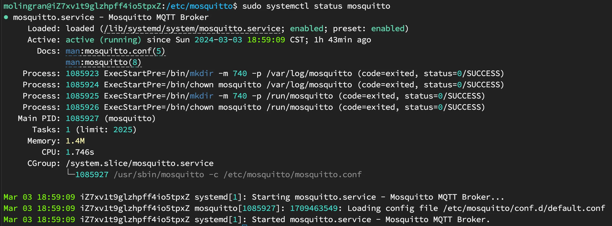

## 安装

更新依赖并安装 mosquitto

```bash
sudo apt update -y && sudo apt install mosquitto mosquitto-clients -y
```

查看 moqsuitto 状态，检查安装是否成功

```bash
sudo systemctl status mosquitto
```



设置开机启动

```bash
sudo systemctl enable mosquitto
```

## 开放远程访问

默认情况下，mosquitto 只允许本地访问，如果需要远程访问，需要修改配置文件。

mosquitto 的配置文件在 `/etc/mosquitto/mosquitto.conf`，根据官方推荐，不要修改这个文件，而是在 `/etc/mosquitto/conf.d/` 目录下创建新的配置文件。(类似 Nginx)

```bash
sudo vim /etc/mosquitto/conf.d/default.conf
```

添加以下内容

```
listener 1883 0.0.0.0
```

## 设置账号密码

mosquitto 默认是不需要账号密码的。如果需要设置账号密码，可以使用以下命令添加账号密码，这里以添加 `mark` 用户为例。

先创建一个密码文件

```bash
sudo touch /etc/mosquitto/passwd
```

使用 `mosquitto_passwd` 命令添加用户

```bash
sudo mosquitto_passwd /etc/mosquitto/passwd mark
```

接着输入两次密码即可。 

然后修改配置文件

```bash
sudo vim /etc/mosquitto/conf.d/default.conf
```

添加以下内容:

```bash
allow_anonymous false
password_file /etc/mosquitto/passwd
```

切记需要重启 mosquitto 服务才会生效。

```bash
sudo systemctl restart mosquitto
```

关于 `mosquitto_passwd` 命令的更多用法，可以查看参考资料中的文档。

## 参考资料

> [How to install and secure Mosquitto on Ubuntu 20.04](https://www.arubacloud.com/tutorial/how-to-install-and-secure-mosquitto-on-ubuntu-20-04.aspx)  
> [mosquitto_passwd man page](https://mosquitto.org/man/mosquitto_passwd-1.html)
